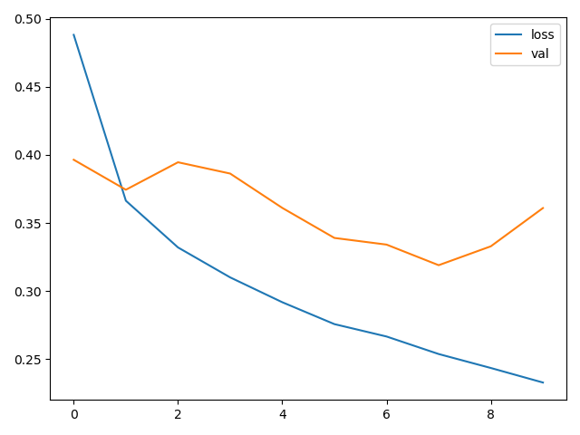
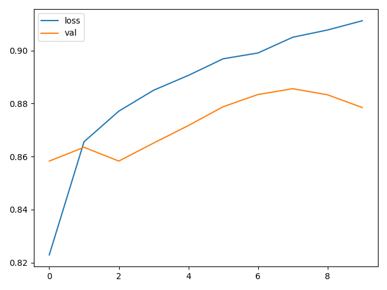
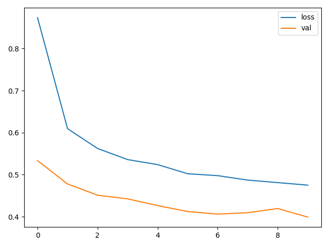
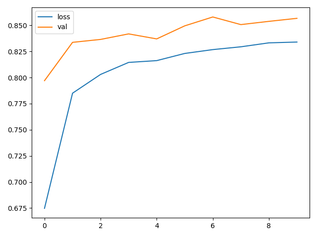
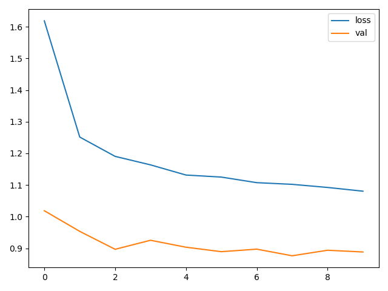
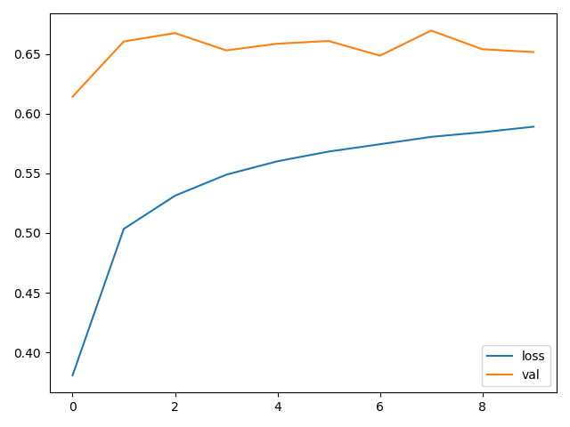

### y = ax + b 型线性回归:

```python
import tensorflow as tf
import pandas as pd
import matplotlib.pyplot as plt

data = pd.read_csv('./data.csv') # 打开一个表格
print(data)

x = data.force
y = data.length_variation
plt.scatter(x, y) # 把表格中的数据在二维平面上描点
plt.show()

model = tf.keras.Sequential()
model.add(tf.keras.layers.Dense(1, input_shape=(1,))) 
print(model.summary())
model.compile(optimizer='adam', loss='mse') # mes 均方差作为损失函数

history = model.fit(x, y, epochs=10000)

print(model.predict(pd.Series([20])))
```


### y = ax + by +cz +d型线性回归:

```python
import tensorflow as tf
import pandas as pd
import matplotlib.pyplot as plt

data = pd.read_csv('./data2.csv')
print(data)
plt.scatter(data.TV, data.sales)
plt.show()

x = data.iloc[:, 0: -1]
y = data.iloc[:, -1]
print(x)
print(y)

model = tf.keras.Sequential(
    [tf.keras.layers.Dense(10, input_shape=(3,), activation='relu'), # 添加一个输入层
     tf.keras.layers.Dense(1) # 输出层
     ]
)
print(model.summary())
model.compile(optimizer='adam', loss='mse')
model.fit(x, y, epochs=10)
```


### 逻辑回归二分类：

```python
import tensorflow as tf
import pandas as pd
import matplotlib.pyplot as plt

data = pd.read_csv('./credit-a.csv', header=None)

x = data.iloc[:, :-1]
y = data.iloc[:, -1].replace(-1, 0)

model = tf.keras.Sequential()
model.add(tf.keras.layers.Dense(4, input_shape=(15,), activation='relu'))
model.add(tf.keras.layers.Dense(4, activation='relu'))
model.add(tf.keras.layers.Dense(1, activation='sigmoid')) #激活函数使用sigmoid

print(model.summary())

model.compile(optimizer='adam', loss='binary_crossentropy', metrics=['acc']) # 使用binary_crossentropy作为损失函数
history = model.fit(x, y, epochs=100)

plt.plot(history.epoch, history.history.get('loss'))
plt.show()
plt.plot(history.epoch, history.history.get('acc'))
plt.show()
```


### softmax多分类：

sparse_categorical_crossentropy和categorical_crossentropy
label 使用连续数字编码用前者，独热编码用后者

#### 连续编码：

使用0，1，2，3，4……表示不同的种类

```python
import tensorflow as tf
import pandas as pd
import matplotlib.pyplot as plt

(train_image, train_label), (test_image, test_label) = tf.keras.datasets.fashion_mnist.load_data()

# 归一化
train_image = train_image / 255
test_image = test_image / 255

print(train_image[0])

# plt.imshow(train_image[0])
# plt.show()

model = tf.keras.Sequential()
# Flatten是二维转一维
model.add(tf.keras.layers.Flatten(input_shape=(28, 28)))
model.add(tf.keras.layers.Dense(128, activation='relu'))
model.add(tf.keras.layers.Dense(10, activation='softmax')) # 输出层使用softmax

model.compile(optimizer='adam', loss='sparse_categorical_crossentropy', metrics=['acc'])

model.fit(train_image, train_label, epochs=10)
model.evaluate(test_image, test_label)
```


#### 独热编码：

使用1和0表示是否是否个种类

[1，0，0，0，0]表示第一个

[0，1，0，0，0]表示第二个

[0，0，1，0，0]表示第三个

[0，0，0，1，0]表示第四个

[0，0，0，0，1]表示第五个

使用tf.keras.utils.to_categorical可以自动转连续编码为独热编码

```python
import tensorflow as tf
import pandas as pd
import matplotlib.pyplot as plt
import numpy as np

(train_image, train_label), (test_image, test_label) = tf.keras.datasets.fashion_mnist.load_data()

train_image = train_image / 255
test_image = test_image / 255

train_label_onehot = tf.keras.utils.to_categorical(train_label)
test_label_onehot = tf.keras.utils.to_categorical(test_label)

model = tf.keras.Sequential()

model.add(tf.keras.layers.Flatten(input_shape=(28, 28)))
model.add(tf.keras.layers.Dense(128, activation='relu'))
model.add(tf.keras.layers.Dense(10, activation='softmax'))
model.compile(optimizer='adam', loss='categorical_crossentropy', metrics=['acc'])

model.fit(train_image, train_label_onehot, epochs=5)
model.evaluate(test_image, test_label_onehot)

predict = model.predict(test_image)
print(predict[0])
print(np.argmax(predict[0]))
```

### 自定义优化器使用：

```python
model.compile(optimizer=tf.keras.optimizers.Adam(learning_rate=0.01), loss='categorical_crossentropy', metrics=['acc'])
```


### 网络优化和参数选择:

#### 网络优化：
增加网络容量：增加层数，增加每层的单元个数
增加层会大大提高拟合能力效果远明显与增加单元个数
单元个数不应过小，避免成为瓶颈，导致欠拟合

```python
import tensorflow as tf
import pandas as pd
import matplotlib.pyplot as plt
import numpy as np
(train_image, train_label), (test_image, test_label) = tf.keras.datasets.fashion_mnist.load_data()
train_image = train_image / 255
test_image = test_image / 255
train_label_onehot = tf.keras.utils.to_categorical(train_label)
test_label_onehot = tf.keras.utils.to_categorical(test_label)
model = tf.keras.Sequential()
model.add(tf.keras.layers.Flatten(input_shape=(28, 28)))
model.add(tf.keras.layers.Dense(128, activation='relu'))
model.add(tf.keras.layers.Dense(128, activation='relu'))
model.add(tf.keras.layers.Dense(128, activation='relu')) # 使用三层网络
model.add(tf.keras.layers.Dense(10, activation='softmax'))
model.compile(optimizer='adam', loss='categorical_crossentropy', metrics=['acc'])
model.fit(train_image, train_label_onehot, epochs=10)
model.evaluate(test_image, test_label_onehot)
```
不能过度增加层数或单元数，会导致参数过多，最终产生过拟合

```python
import tensorflow as tf
import pandas as pd
import matplotlib.pyplot as plt
import numpy as np
(train_image, train_label), (test_image, test_label) = tf.keras.datasets.fashion_mnist.load_data()
train_image = train_image / 255
test_image = test_image / 255
train_label_onehot = tf.keras.utils.to_categorical(train_label)
test_label_onehot = tf.keras.utils.to_categorical(test_label)
model = tf.keras.Sequential()
model.add(tf.keras.layers.Flatten(input_shape=(28, 28)))
model.add(tf.keras.layers.Dense(128, activation='relu'))
model.add(tf.keras.layers.Dense(128, activation='relu'))
model.add(tf.keras.layers.Dense(128, activation='relu'))
model.add(tf.keras.layers.Dense(10, activation='softmax'))
# validation_data训练一次对test数据集测试获取正确率
model.compile(optimizer='adam', loss='categorical_crossentropy', metrics=['acc'])
history = model.fit(train_image, train_label_onehot, epochs=10, validation_data=(test_image, test_label_onehot))
plt.plot(history.epoch, history.history.get('loss'), label='train-loss')
plt.plot(history.epoch, history.history.get('val_loss'), label='test-loss')
plt.legend()
plt.show()
# loss在test数据集上没有单调下降


plt.plot(history.epoch, history.history.get('acc'), label='train-acc')
plt.plot(history.epoch, history.history.get('val_acc'), label='test-acc')
plt.legend()
plt.show()
# acc在训练集上得分较高，而测试集上没那么高
# 欠拟合则在两个集上得分都不高
```

loss图：



正确率图：




#### 参数选择：

1.开发一个过拟合模型，确保有足够的拟合能力
2.添加更多的层
3.让每一层更大
4.训练更多的轮次
然后抑制过拟合（在不能增加数据的前提下，否则增加数据是最好的方法）：
1.dropout
2.正则化
3.图像增强
使用较小规模的网络有利于解决过拟合

dropout在训练的时候会随机在每层中选一些单元训练，预测的时候使用全部单元
可理解为使用数据集训练了多个不同的网络，最后取平均的效果

```python
import tensorflow as tf
import pandas as pd
import matplotlib.pyplot as plt
import numpy as np
(train_image, train_label), (test_image, test_label) = tf.keras.datasets.fashion_mnist.load_data()
train_image = train_image / 255
test_image = test_image / 255
train_label_onehot = tf.keras.utils.to_categorical(train_label)
test_label_onehot = tf.keras.utils.to_categorical(test_label)
model = tf.keras.Sequential()
model.add(tf.keras.layers.Flatten(input_shape=(28, 28)))
model.add(tf.keras.layers.Dense(128, activation='relu'))
model.add(tf.keras.layers.Dropout(0.5))
model.add(tf.keras.layers.Dense(128, activation='relu'))
model.add(tf.keras.layers.Dropout(0.5))
model.add(tf.keras.layers.Dense(10, activation='softmax'))
model.compile(optimizer='adam', loss='categorical_crossentropy', metrics=['acc'])
history = model.fit(train_image, train_label_onehot, epochs=10, validation_data=(test_image, test_label_onehot))
plt.plot(history.epoch, history.history.get('loss'), label='train-loss')
plt.plot(history.epoch, history.history.get('val_loss'), label='test-loss')
plt.legend()
plt.show()
plt.plot(history.epoch, history.history.get('acc'), label='train-acc')
plt.plot(history.epoch, history.history.get('val_acc'), label='test-acc')
plt.legend()
plt.show()
```

loss图：



正确率图：




使用较小规模网络：

```python
import tensorflow as tf
import pandas as pd
import matplotlib.pyplot as plt
import numpy as np
(train_image, train_label), (test_image, test_label) = tf.keras.datasets.fashion_mnist.load_data()
train_image = train_image / 255
test_image = test_image / 255
train_label_onehot = tf.keras.utils.to_categorical(train_label)
test_label_onehot = tf.keras.utils.to_categorical(test_label)
model = tf.keras.Sequential()
model.add(tf.keras.layers.Flatten(input_shape=(28, 28)))
model.add(tf.keras.layers.Dense(32, activation='relu'))
model.add(tf.keras.layers.Dropout(0.5))
model.add(tf.keras.layers.Dense(32, activation='relu'))
model.add(tf.keras.layers.Dropout(0.5))
model.add(tf.keras.layers.Dense(10, activation='softmax'))
model.compile(optimizer='adam', loss='categorical_crossentropy', metrics=['acc'])
history = model.fit(train_image, train_label_onehot, epochs=10, validation_data=(test_image, test_label_onehot))
plt.plot(history.epoch, history.history.get('loss'), label='train-loss')
plt.plot(history.epoch, history.history.get('val_loss'), label='test-loss')
plt.legend()
plt.show()
plt.plot(history.epoch, history.history.get('acc'), label='train-acc')
plt.plot(history.epoch, history.history.get('val_acc'), label='test-acc')
plt.legend()
plt.show()
```

loss图：



正确率图：



正确率说明使用小规模的网络训练次数需要更多，训练集的正确率都不到0.6。在过拟合问题上比大规模网络要好一点


### 函数式api使用方法：

可以自由拓展，如多输入

```python
import tensorflow as tf
import pandas as pd
import matplotlib.pyplot as plt
import numpy as np
(train_image, train_label), (test_image, test_label) = tf.keras.datasets.fashion_mnist.load_data()
train_image = train_image / 255
test_image = test_image / 255
# print(train_image.shape)

input_layer = tf.keras.Input(shape=(28, 28))
x = tf.keras.layers.Flatten()(input_layer)
x = tf.keras.layers.Dense(64, activation='relu')(x)
x = tf.keras.layers.Dropout(0.5)(x)
x = tf.keras.layers.Dense(64, activation='relu')(x)
x = tf.keras.layers.Dropout(0.5)(x)
output_layer = tf.keras.layers.Dense(10, activation='softmax')(x)
model = tf.keras.Model(inputs=input_layer, outputs=output_layer)

print(model.summary())
...
```


###  tf.data:

#### 一维链表：

```python
import tensorflow as tf

dataset = tf.data.Dataset.from_tensor_slices([1, 2, 3, 4])
print(dataset)
for x in dataset:
    print(x)
    print(x.numpy())
```

结果：

```python
<TensorSliceDataset shapes: (), types: tf.int32>
tf.Tensor(1, shape=(), dtype=int32)
1
tf.Tensor(2, shape=(), dtype=int32)
2
tf.Tensor(3, shape=(), dtype=int32)
3
tf.Tensor(4, shape=(), dtype=int32)
4
```

#### 二维链表：

```python
import tensorflow as tf

dataset = tf.data.Dataset.from_tensor_slices([[1, 2], [3, 4]]) # 数据类型要一样

print(dataset)
for x in dataset:
    print(x)
    print(x.numpy())
```

结果：

```python
<TensorSliceDataset shapes: (2,), types: tf.int32>
tf.Tensor([1 2], shape=(2,), dtype=int32)
[1 2]
tf.Tensor([3 4], shape=(2,), dtype=int32)
[3 4]
```

#### 字典：

```python
import tensorflow as tf

dataset = tf.data.Dataset.from_tensor_slices({'a': [1, 2], 'b': [6, 7], 'c': [10, 11]}) 

print(dataset)
for x in dataset:
    print(x)
```

结果：

```python
<TensorSliceDataset shapes: {a: (), b: (), c: ()}, types: {a: tf.int32, b: tf.int32, c: tf.int32}>
        
{'a': <tf.Tensor: id=10, shape=(), dtype=int32, numpy=1>, 'b': <tf.Tensor: id=11, shape=(), dtype=int32, numpy=6>, 'c': <tf.Tensor: id=12, shape=(), dtype=int32, numpy=10>}

{'a': <tf.Tensor: id=13, shape=(), dtype=int32, numpy=2>, 'b': <tf.Tensor: id=14, shape=(), dtype=int32, numpy=7>, 'c': <tf.Tensor: id=15, shape=(), dtype=int32, numpy=11>}
```

#### array:

```python
import tensorflow as tf
import numpy as np

dataset = tf.data.Dataset.from_tensor_slices(np.array([1, 2, 3, 4]))

print(dataset)
for x in dataset:
    print(x)
```

结果与一维链表一样


#### dataset.take(x)方法：

```python
import tensorflow as tf
import numpy as np

dataset = tf.data.Dataset.from_tensor_slices(np.array([1, 2, 3, 4]))

for x in dataset.take(2): # 取出两个
    print(x)
```

结果：

```python
tf.Tensor(1, shape=(), dtype=int32)
tf.Tensor(2, shape=(), dtype=int32)
```


#### dataset.shuffle()方法：

```python
import tensorflow as tf
import numpy as np

dataset = tf.data.Dataset.from_tensor_slices(np.array([1, 2, 3, 4]))
dataset = dataset.shuffle(buffer_size=2) # 选几个数乱序
for x in dataset:
    print(x)

结果：
tf.Tensor(2, shape=(), dtype=int32)
tf.Tensor(1, shape=(), dtype=int32)
tf.Tensor(4, shape=(), dtype=int32)
tf.Tensor(3, shape=(), dtype=int32)
   
dataset = tf.data.Dataset.from_tensor_slices(np.array([1, 2, 3, 4]))
dataset = dataset.shuffle(buffer_size=2).repeat(count=2) #默认为None，一直循环
for x in dataset:
    print(x)
结果：
tf.Tensor(1, shape=(), dtype=int32)
tf.Tensor(2, shape=(), dtype=int32)
tf.Tensor(3, shape=(), dtype=int32)
tf.Tensor(4, shape=(), dtype=int32)
tf.Tensor(1, shape=(), dtype=int32)
tf.Tensor(2, shape=(), dtype=int32)
tf.Tensor(3, shape=(), dtype=int32)
tf.Tensor(4, shape=(), dtype=int32)
```

#### dataset.batch()方法：

```python
import tensorflow as tf
import numpy as np

dataset = tf.data.Dataset.from_tensor_slices(np.array([1, 2, 3, 4]))
dataset = dataset.shuffle(buffer_size=2)
dataset1 = dataset.batch(batch_size=3) #把dataset中的数据按照大小打包
for x in dataset1:
    print(x)
结果：
tf.Tensor([1 3 4], shape=(3,), dtype=int32)
tf.Tensor([2], shape=(1,), dtype=int32)

dataset2 = dataset.batch(batch_size=2)
for x in dataset2:
    print(x)
结果：
tf.Tensor([1 2], shape=(2,), dtype=int32)
tf.Tensor([3 4], shape=(2,), dtype=int32)
```


#### dataset.map()方法：

```python
import tensorflow as tf
import numpy as np

dataset = tf.data.Dataset.from_tensor_slices(np.array([1, 2, 3, 4]))
dataset = dataset.map(lambda x: x * x)
for x in dataset:
    print(x)
```

结果：

```python
tf.Tensor(1, shape=(), dtype=int32)
tf.Tensor(4, shape=(), dtype=int32)
tf.Tensor(9, shape=(), dtype=int32)
tf.Tensor(16, shape=(), dtype=int32)
```


#### dataset用于输入：

```python
import tensorflow as tf
import pandas as pd
import matplotlib.pyplot as plt
import numpy as np
(train_image, train_label), (test_image, test_label) = tf.keras.datasets.fashion_mnist.load_data()
# 图片归一化
train_image = train_image / 255
test_image = test_image / 255

ds_train_image = tf.data.Dataset.from_tensor_slices(train_image)
ds_train_label = tf.data.Dataset.from_tensor_slices(train_label)
# 把图片和结果对应起来
ds_train = tf.data.Dataset.zip((ds_train_image, ds_train_label))
# 每次取64张图片，乱序10000张，无限重复
ds_train = ds_train.shuffle(10000).repeat().batch(64)

model = tf.keras.Sequential()
model.add(tf.keras.layers.Flatten(input_shape=(28, 28)))
model.add(tf.keras.layers.Dense(128, activation='relu'))
model.add(tf.keras.layers.Dense(128, activation='relu'))
model.add(tf.keras.layers.Dense(128, activation='relu'))
model.add(tf.keras.layers.Dense(10, activation='softmax'))
model.compile(optimizer='adam', loss='sparse_categorical_crossentropy', metrics=['acc'])
# 每次迭代的步数 总大小/batch_size
steps_per_epoch = train_image.shape[0] // 64
# 训练5次
model.fit(ds_train, epochs=5, steps_per_epoch=steps_per_epoch)
```

同时加入test数据集的dataset

```python
import tensorflow as tf
import pandas as pd
import matplotlib.pyplot as plt
import numpy as np
(train_image, train_label), (test_image, test_label) = tf.keras.datasets.fashion_mnist.load_data()
# 图片归一化
train_image = train_image / 255
test_image = test_image / 255

ds_train_image = tf.data.Dataset.from_tensor_slices(train_image)
ds_train_label = tf.data.Dataset.from_tensor_slices(train_label)
ds_test_image = tf.data.Dataset.from_tensor_slices(test_image)
ds_test_label = tf.data.Dataset.from_tensor_slices(test_label)
# 把图片和结果对应起来
ds_train = tf.data.Dataset.zip((ds_train_image, ds_train_label))
ds_test = tf.data.Dataset.zip((ds_test_image, ds_test_label))
# 每次取64张图片，乱序10000张，无限重复
ds_train = ds_train.shuffle(10000).repeat().batch(64)
ds_test = ds_test.batch(64)

model = tf.keras.Sequential()
model.add(tf.keras.layers.Flatten(input_shape=(28, 28)))
model.add(tf.keras.layers.Dense(128, activation='relu'))
model.add(tf.keras.layers.Dense(128, activation='relu'))
model.add(tf.keras.layers.Dense(128, activation='relu'))
model.add(tf.keras.layers.Dense(10, activation='softmax'))
model.compile(optimizer='adam', loss='sparse_categorical_crossentropy', metrics=['acc'])
# 每次迭代的步数 总大小/batch_size
steps_per_epoch = train_image.shape[0] // 64
# 训练5次 validation_steps和steps_per_epoch计算方法相同
model.fit(ds_train, epochs=5, steps_per_epoch=steps_per_epoch, validation_data=ds_test, validation_steps=10000 // 64)
```


### 卷积神经网络：

```py
卷积层

layers.Conv2D():

-filters:卷积核数量
-kernel_size:卷积核大小(eg:(3*3))
-strides:跨度，(x,y)横向跨x，纵向跨y
-padding:填充，'valid'不填充，'same'填充
-activation:激活方式
-use_bias:true or false 是否添加权重
-data_format:
-...
```


```python
非线性层

relu
sigmoid
tanh
```


```python
池化层：用于降采样

layers.MaxPooling2D 最大池化，每块选取最大值（一般用这个）
layers.AvgPooling2D 平均池化，每块取平均值

-pool_size: 池化核的大小(eg:(2*2))
-strides:跨度，一般不用
-padding:填充
-dataformat:
```

从图片到得出结果的大致过程：


```python
import tensorflow as tf
import pandas as pd
import matplotlib.pyplot as plt
import numpy as np

(train_image, train_label), (test_image, test_label) = tf.keras.datasets.fashion_mnist.load_data()

train_image = np.expand_dims(train_image, -1) # 扩张维度 (None, hight, width, chanal)
test_image = np.expand_dims(test_image, -1)

model = tf.keras.Sequential()
model.add(tf.keras.layers.Conv2D(32, (3, 3), input_shape=(28, 28, 1), padding='same', activation='relu'))# 添加卷积层
model.add(tf.keras.layers.MaxPool2D())
model.add(tf.keras.layers.Conv2D(64, (3, 3), activation='relu'))
model.add(tf.keras.layers.GlobalAveragePooling2D())
model.add(tf.keras.layers.Dense(10, activation='softmax'))

model.compile(optimizer='adam',
             loss='sparse_categorical_crossentropy',
             metrics=['acc']
             )
history = model.fit(train_image, train_label, epochs=30, validation_data=(test_image, test_label))

plt.plot(history.epoch, history.history.get('loss'), label='train-loss')
plt.plot(history.epoch, history.history.get('val_loss'), label='test-loss')
plt.legend()
plt.show()
plt.plot(history.epoch, history.history.get('acc'), label='train-acc')
plt.plot(history.epoch, history.history.get('val_acc'), label='test-acc')
plt.legend()
plt.show()
```


存在着过拟合问题

```python
model = tf.keras.Sequential()
model.add(tf.keras.layers.Conv2D(64, (3, 3), input_shape=(28, 28, 1), padding='same', activation='relu'))
model.add(tf.keras.layers.Conv2D(64, (3, 3), input_shape=(28, 28, 1), padding='same', activation='relu'))
model.add(tf.keras.layers.MaxPool2D())
model.add(tf.keras.layers.Dropout(0.5))
model.add(tf.keras.layers.Conv2D(128, (3, 3), activation='relu', padding='same'))
model.add(tf.keras.layers.Conv2D(128, (3, 3), activation='relu', padding='same'))
model.add(tf.keras.layers.MaxPool2D())
model.add(tf.keras.layers.Dropout(0.5))
model.add(tf.keras.layers.Conv2D(256, (3, 3), activation='relu', padding='same'))
model.add(tf.keras.layers.Conv2D(256, (3, 3), activation='relu', padding='same'))
model.add(tf.keras.layers.GlobalAveragePooling2D())
model.add(tf.keras.layers.Dense(256, activation='relu'))
model.add(tf.keras.layers.Dense(10, activation='softmax'))

model.compile(optimizer='adam',
             loss='sparse_categorical_crossentropy',
             metrics=['acc']
             )
history = model.fit(train_image, train_label, epochs=30, validation_data=(test_image, test_label))
```

